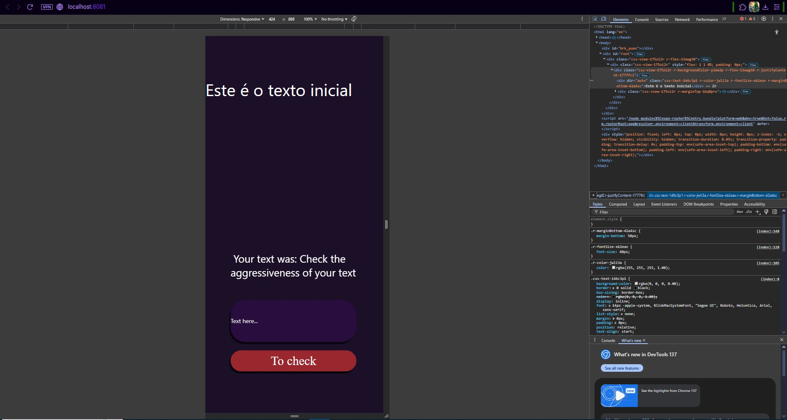
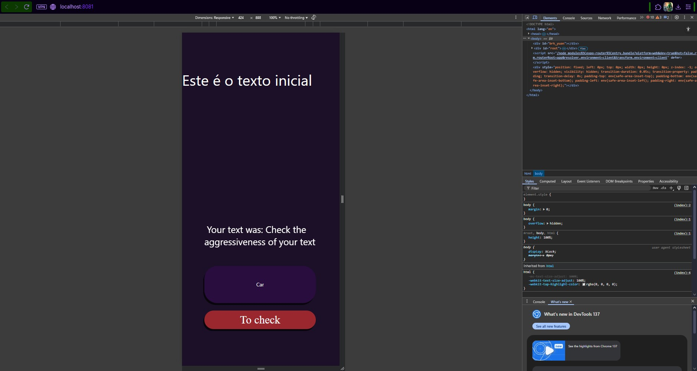
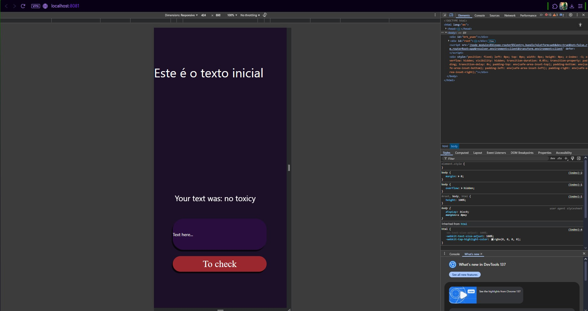

# 🧠 Toxicity Checker App

Um aplicativo em **React Native** que utiliza **TensorFlow.js** para detectar toxicidade em textos (insulto, ameaça, ofensa, etc.).  

📱 O usuário digita uma frase e o app retorna se há algum tipo de agressividade ou se o texto é seguro.

---

## 🚀 Funcionalidades

- Entrada de texto pelo usuário.  
- Classificação de toxicidade com modelo do **TensorFlow.js**.  
- Retorna a categoria mais provável (ex.: *insult*, *threat*, *identity attack*).  
- Se não houver nada relevante, exibe **"no toxicy"**.  
- Histórico simples dos textos digitados.  

---

## 📸 Screenshots

| Tela inicial | Texto comum | Sem toxicidade |
|--------------|-------------|----------------|
|  |  |  |

| Texto ofensivo | Exemplo de insulto |
|----------------|--------------------|
|  |  |

---

## 🛠️ Tecnologias usadas

- [React Native](https://reactnative.dev/)  
- [TensorFlow.js](https://www.tensorflow.org/js)  
- [Expo (opcional)]  

---

## 📂 Estrutura do Projeto

